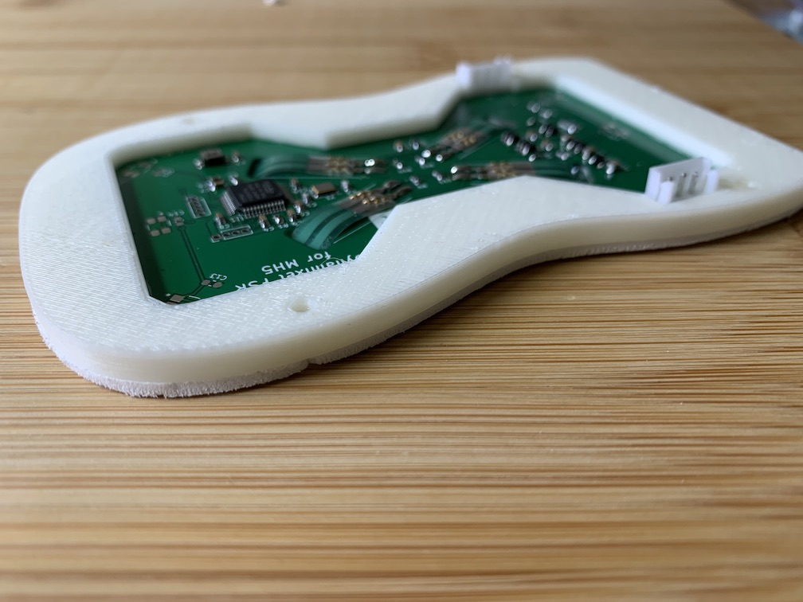

# SPR2010

MH5 robot feet with Force Sensitive Resistors (FSR) and Dynamixel support.

The feet are used in the [MH5](https://github.com/sonelu/MH5) robot to obtain
better information about the stance of the robot. Each device includes 4
force sensitive resistors (FSRs) that exhibit variable conductance in proportion
with the force exerted on them.

The device uses an STM32F103CB MCU to process this information and the firmware
includes communication support for Dynamixel protocol. The additional components
on the board allow the device to be directly integrated in a Dynamixel chain (TTL only)
(i.e. to directly continue the chain from each leg) and provide extensive
information to the main robot controller.

Since, typically they will be the first device connected to the batteries
in MH5 robot architecture the device includes also a voltage and current
monitor that allows the main robot controller to get accurate information
about the battery voltage and about the current consumption from each of the
two batteries located in the feet.

All information is provided in using Dynamixel protocol and providing a set
of registers for the master controller.

## Technical Specifications

Topic | Value | Comments
------|-------|----------
MCU   | [STM32F103CB](https://www.st.com/en/microcontrollers-microprocessors/stm32f103cb.html#overview) | 32 bit processor, 72Mhz, 20KB SRAM, 128 KB flash
Force Sensors | [FSR400](https://www.interlinkelectronics.com/fsr-400-series#tab-1) | 
range 0.2N - 20N per sensor  4 sensors located in the corners of the feet and referred to as:<li>front right (FR) <li>front left (FL) <li>back right (BR) <li> back left (BL)

Bumpers | Tactile switch | <b>Not included in the Rev B.1 due to complex 3D model of feet to accomodate. Will be reintroduced in the next version with a simpler model for physical bumpers.</b> The bumpers are provided for feedback on physical contact between the feet and an object. There are 6 bumpers referred to as:<li>front left (FL)<li>front center (FC)<li>front right (FR)<li>back left (BL)<li>back center (BC)<li>back right (BR)
Voltage monitor | [ZXCT1010](https://www.diodes.com/part/view/ZXCT1010) | ZXCT1010, in conjustion with a 0.02 ohm shut provide a current monitor  a 1:4 voltage divider provide a voltage monitor both are fed as imput in the MCU that converts the data into Voltage and Current readings
Interface | [Dynamixel](https://emanual.robotis.com/docs/en/dxl/) | Supports [protocol 1](https://emanual.robotis.com/docs/en/dxl/protocol1/) and [protocol 2](https://emanual.robotis.com/docs/en/dxl/protocol2/).  For the time being only the following instructions are supported:<li>[Ping](https://emanual.robotis.com/docs/en/dxl/protocol2/#ping-0x01) <li>[Read](https://emanual.robotis.com/docs/en/dxl/protocol2/#read-0x02) <li>[Write](https://emanual.robotis.com/docs/en/dxl/protocol2/#write-0x03) (for control parameters)  See more details in [registers]()
